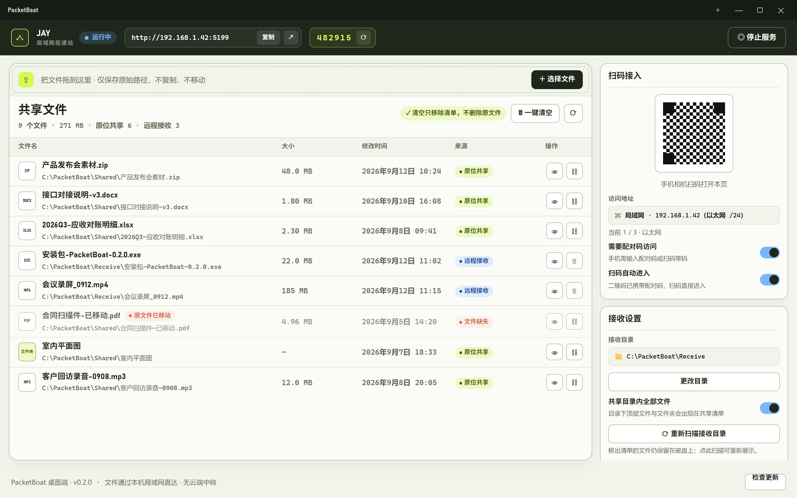
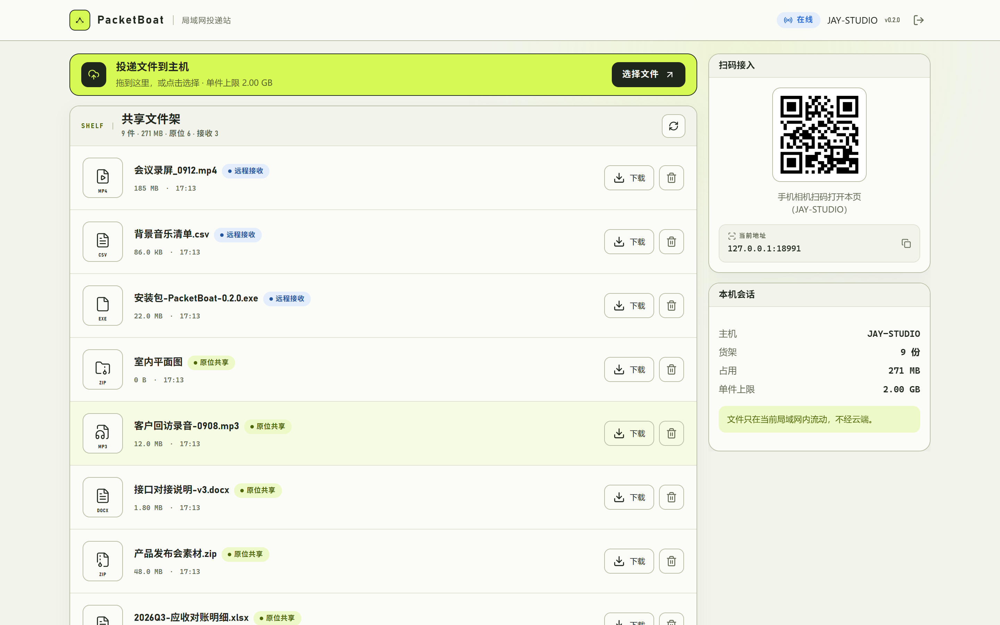
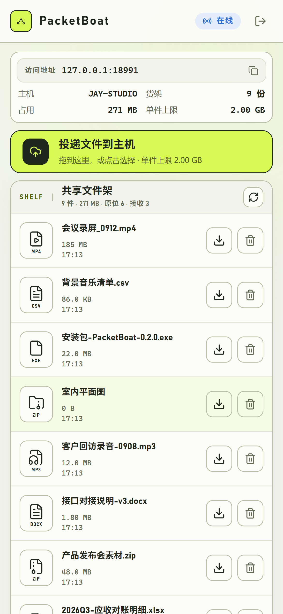
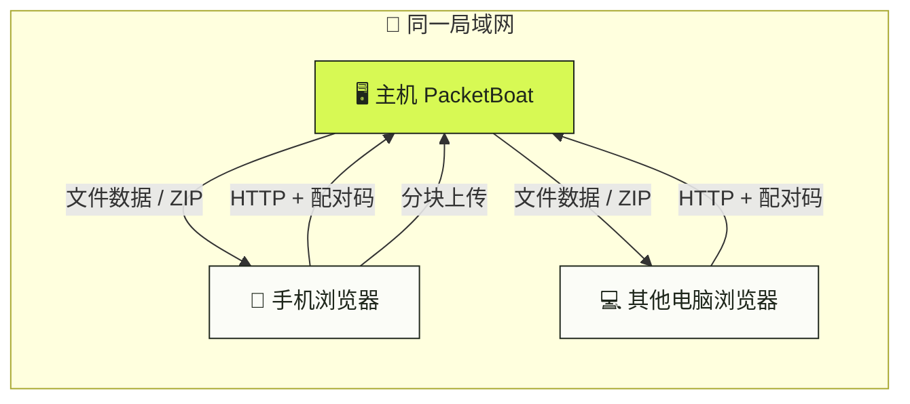

<div align="center">


# 🚢 PacketBoat 局域网投递站

**同一 Wi-Fi 下，用浏览器互传文件 —— 数据只在局域网流动，不经云端中转。**

发送端无需安装客户端：打开主机显示的地址，输入六位配对码，即可上传文件，或下载主机分享的内容。

[](https://github.com/Jadramcool/package-boat/releases)
[](LICENSE)
[](https://github.com/Jadramcool/package-boat/releases)
[](https://www.rust-lang.org/)
[](https://v2.tauri.app/)
[](https://vuejs.org/)

[快速开始](#-快速开始) · [功能](#-功能) · [界面预览](#-界面预览) · [安全说明](#️-安全说明) · [参与贡献](#-参与贡献)




</div>

---

## ✨ 为什么是 PacketBoat

| 痛点 | PacketBoat 的做法 |
|---|---|
| 😩 微信 / 网盘传大文件慢、要登录、压画质 | 🚀 局域网直达，带宽吃满你的路由器 |
| 😰 把文件丢进公有云，隐私不可控 | 🔒 数据不经公网中转，会话仅存在于主机内存 |
| 😵 对方要装客户端 / 注册账号 | 📱 浏览器打开地址 + 六位配对码即可 |
| 💥 误点「删除」把源文件也删了 | 🛡️ **清单操作从不删除磁盘文件** |

> 🧭 设计原则：**投递站，不是网盘。** 共享只是登记路径；移出清单只是改清单。你的文件始终留在磁盘原处。

---

## 🎯 功能

### ⚡ 传输

- 📦 **分块上传**：会话协商块大小、逐块 SHA-256 校验、缺块续传与失败重试，完成后原子提交
- 📊 **浏览器上传队列**：可配置并发数、实时速度与剩余时间、单任务暂停 / 继续 / 取消、传输历史
- ⬇️ **断点下载**：单文件 Range 下载，256 KiB 流缓冲
- 🗜️ **文件夹流式 ZIP**：边压缩边发送，不落完整临时压缩包
- 💾 **稳健落盘**：磁盘空间预检（不足返回 507）、写满错误识别、24 小时残留 `.part` 回收
- 🪟 **Windows 任务栏进度**：传输进度直接显示在任务栏图标上
- 🔁 **应用内自动更新**：启动静默检查，发现新版本一键安装重启

### 📂 共享与目录表

- 🔗 **原位共享**：只记录路径，不复制、不移动源文件
- 🧹 **安全移除**：移出清单 / 取消共享 / 一键清空 —— 只改记录，**从不删除**磁盘上的原文件或接收文件
- 📥 **接收目录可控**：默认不自动扫描；可选「共享目录内全部文件」开关，把接收目录顶层内容以本地扫描来源加入清单
- 🔎 **独立重扫**：「重新扫描接收目录」把此前移出清单的本地文件加回来（与开关键解耦，重启不会偷偷恢复）
- 🏷️ **来源可辨**：条目标记「原位共享」「远程接收」「本地扫描」；源文件被移动时保留条目并标为不可用
- ⚡ **列表性能**：短 TTL 缓存 + 文件系统监听增量刷新，大目录也能快速打开

### 🔐 认证与安全

- 🔢 **六位配对码**：桌面命令条可一键热刷新（不重启服务；已连接设备会话保持，新设备用新码）
- 🚦 **按 IP 限速**：降低暴力猜码风险
- 🍪 **内存会话** + HttpOnly / SameSite Cookie；除设备信息与配对外，API 均需有效会话
- 🚫 **拒绝符号链接**：共享与下载只解析目录表中已登记的条目

### 📡 实时与连接

- 📺 **SSE 实时刷新**文件列表；慢消费者不阻塞文件操作，断线重连自动补拉
- 🌐 **多网卡地址列举**、端口回退与自动分配
- 📷 **访问地址二维码**（可携带配对码扫码即连）、一键复制地址

### 🖥️ 桌面端（Windows）

- 🎨 晴空码头视觉：深海墨 × 航速绿 × 船坞白，无边框自定义标题栏
- 📌 系统托盘常驻，关闭窗口最小化到托盘，服务可窗口置顶
- 🖱️ 拖拽文件 / 文件夹到窗口即原位共享
- 🧭 **双栏独立滚动**：左侧共享清单与右侧设置栏各自滚动，卡片不压扁，提示条常驻上方
- 🔐 接收目录设置、服务开关、配对码刷新、二维码扫码接入

### 🌐 浏览器接收页

- 📱 手机 / 平板 / 其他电脑均可访问，响应式双栏工作区
- ⬆️ 拖拽或选择文件上传，队列可视化管理
- ⬇️ 浏览主机共享的文件与文件夹（文件夹以 ZIP 流式下载）
- 📋 会话信息、在线状态、扫码接入提示

### 🗺️ 计划中（尚未支持）

- mDNS 设备发现 · 英文界面 · 安装包代码签名 · HTTPS 与端到端加密 · 跨平台桌面打包

完整路线见 [ROADMAP.md](ROADMAP.md)。

---

## 🖼️ 界面预览

以下截图基于当前仓库的真实界面（设计系统与布局来自生产前端；桌面端列表使用演示数据，不包含个人文件）。

### 🖥️ Windows 桌面端

主机在这里管理共享清单、配对码、接收目录与服务状态。清空 / 移出只改清单，不删除磁盘文件。


### 🌐 浏览器接收页（电脑）

配对成功后的工作区：投递上传、共享文件架、扫码接入与会话信息。



### 🔐 浏览器配对门

同一局域网设备打开访问地址后，输入主机屏幕上的六位配对码即可进入。


### 📱 浏览器接收页（手机）

手机浏览器访问同一地址后的响应式布局：上传投递、浏览共享架、下载文件。



---

## 🚀 快速开始

### 环境要求

| 组件 | 说明 |
|---|---|
| 🪟 Windows 10 / 11 | 当前仅面向 Windows 桌面端 |
| 🦀 Rust stable | 编译核心服务与桌面端 |
| 📦 Node.js + pnpm | 前端构建（仓库通过 `packageManager` 固定 pnpm 版本） |
| 🧰 [Tauri 2 Windows 依赖](https://v2.tauri.app/start/prerequisites/) | WebView2、MSVC 等 |

### 安装使用（发布包）

1. 前往 [Releases](https://github.com/Jadramcool/package-boat/releases) 下载 Windows NSIS 安装包（附 `SHA256SUMS.txt`）
2. 安装并打开 PacketBoat，窗口会自动启动局域网服务
3. 记下界面上的 **访问地址** 与 **六位配对码**
4. 在同一 Wi-Fi 的手机 / 电脑浏览器打开该地址，输入配对码
5. 开始上传投递，或下载主机共享的文件 🎉

### 从源码开发

```powershell
pnpm install --frozen-lockfile
pnpm run dev:desktop
```

窗口打开后服务自动启动。浏览器接收页热更新（**不要**同时开 `dev:web` 占用 5173 以外的冲突场景时，请先起桌面端）：

```powershell
pnpm run dev:desktop   # 终端 1：桌面端 + 后端服务
pnpm run dev:web       # 终端 2：浏览器接收页 Vite 热更新
```

若服务使用其他端口，可通过 `PACKETBOAT_DEV_SERVER_URL` 覆盖 Vite 的 `/api` 代理目标。

生产构建：

```powershell
pnpm run build           # 前端构建 + 同步嵌入资源
pnpm run build:desktop   # Windows 安装包
```

---

## 🧭 典型用法

```text
主机（装了 PacketBoat 的 Windows）
  │  启动服务 → 显示 http://192.168.x.x:port + 配对码 482915
  │
  ├─ 拖拽文件到窗口 ──► 原位共享（路径登记，不复制）
  │
  └─ 同一 Wi-Fi 的手机 / 同事电脑
        浏览器打开地址 → 输入配对码
        ├─ ⬆️ 上传文件 → 写入主机「接收目录」
        └─ ⬇️ 下载共享文件 / 文件夹 ZIP
```

**安全边界** 🛡️：在桌面端或浏览器里「移出 / 清空 / 删除共享条目」只会更新共享清单，**磁盘上的文件原封不动**。需要恢复本地扫描条目时，使用接收设置里的「重新扫描接收目录」。

---

## 🏗️ 架构一览

```text
Vue browser UI ── HTTP / SSE ──► packetboat-core（Axum）
                                      ▲
                                      │ Tauri commands
                                      │
                               packetboat-desktop（Windows）
                                      ▲
                               Vue desktop UI
```

| 模块 | 职责 |
|---|---|
| `crates/packetboat-core` | HTTP 服务、认证、目录表、分块上传 / Range 下载 / 流式 ZIP、SSE |
| `crates/packetboat-desktop` | Tauri 2 桌面壳：托盘、命令、窗口生命周期 |
| `apps/desktop` | 统一 Vue 3 前端（桌面端 + 浏览器接收页） |

生产构建会把 Vite 产物同步到 `packetboat-core/assets/dist`，由 `rust-embed` 编入桌面服务。

更细的设计说明见 [docs/ARCHITECTURE.md](docs/ARCHITECTURE.md)，分块协议见 [docs/UPLOAD_PROTOCOL.md](docs/UPLOAD_PROTOCOL.md)，性能基准见 [docs/BENCHMARKS.md](docs/BENCHMARKS.md)。



---

## 📁 仓库结构

```text
package-boat/
├── crates/
│   ├── packetboat-core/        # 🦀 HTTP 服务、认证、目录表与传输逻辑
│   └── packetboat-desktop/     # 🪟 Tauri 2 Windows 桌面端
├── apps/
│   └── desktop/                # 💚 统一 Vue 3 前端（桌面 + 浏览器接收页）
├── docs/                       # 📚 架构、协议、基准与配图
│   └── images/                 # 🖼️ README 界面预览
├── design/                     # 🎨 设计稿与 as-built 截图
├── CHANGELOG.md                # 📝 版本变化
├── ROADMAP.md                  # 🗺️ 路线图
├── SECURITY.md                 # 🔐 安全政策
└── CONTRIBUTING.md             # 🤝 贡献指南
```

---

## 🧪 质量检查

提交前请跑通：

```powershell
cargo fmt --all -- --check
cargo clippy --workspace --all-targets -- -D warnings
cargo test --workspace

# 快速端到端传输基准
cargo bench -p packetboat-core --bench transfer -- --profile smoke

pnpm install --frozen-lockfile
pnpm run test
pnpm run build
pnpm run check:versions
```

涉及传输协议时请补充 `crates/packetboat-core/tests` 下的集成测试；涉及 UI 时至少完成类型检查与生产构建。`pnpm run build` 会刷新 `packetboat-core/assets/dist`，请将对应嵌入资源一并提交。

---

## 🛡️ 安全说明

PacketBoat 的威胁模型是 **可信局域网**，不是公网文件托管：

- ⚠️ 请勿直接把服务映射到公网；当前版本不提供 TLS、账户体系或端到端加密
- 🔐 配对码用于同网段轻量准入，不替代专业身份认证
- 🧹 共享清单操作不会删除磁盘文件，但仍请勿在不受信任的机器上运行主机
- 🐛 发现安全问题请按 [SECURITY.md](SECURITY.md) **私下**报告，不要开公开 issue

---

## 🗺️ 路线图摘要

**近期** ✅ 开源基础与可靠性（基准、临时文件回收、自动更新等）  
**中期** 🚧 传输体验打磨、mDNS 设备发现  
**长期** 🌍 跨平台、可选 HTTPS、端到端加密  

详见 [ROADMAP.md](ROADMAP.md) 与 [CHANGELOG.md](CHANGELOG.md)。

---

## 🤝 参与贡献

欢迎 issue 与 PR！开始前请阅读：

- 📖 [CONTRIBUTING.md](CONTRIBUTING.md) — 分支、检查清单、提交规范
- 💬 [CODE_OF_CONDUCT.md](CODE_OF_CONDUCT.md) — 行为准则
- 🔐 [SECURITY.md](SECURITY.md) — 漏洞报告方式

> 💡 大功能请先开 issue 对齐方案；PR 聚焦单一问题，并附上测试结果。  
> 贡献代码即表示同意按 MIT License 发布。

---

## 📄 License

[MIT](LICENSE) © PacketBoat contributors

---

<div align="center">

**如果 PacketBoat 帮你在局域网里少折腾了一次文件传输，给个 Star 吧 ⭐**

Made with 🦀 Rust · 💚 Vue · 🚢 PacketBoat

</div>
